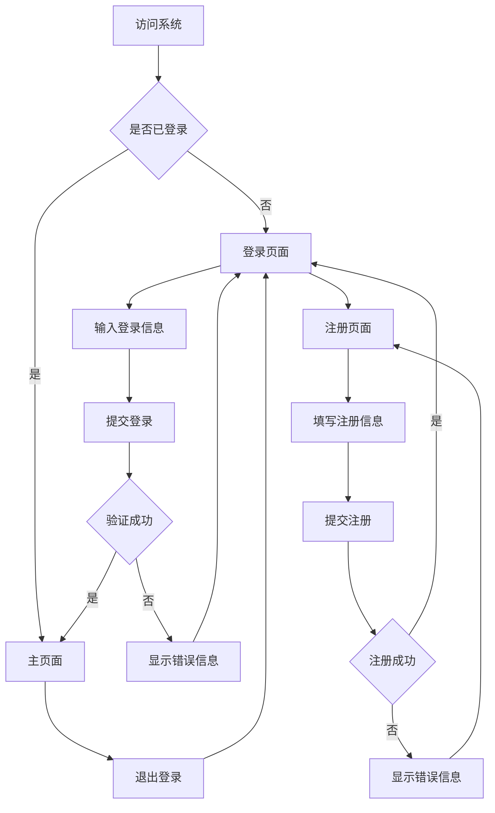

# Banyan ERP系统 - 前端重构与用户认证功能产品需求文档

## 1. 产品概述

Banyan ERP系统前端重构项目，旨在构建现代化的用户界面和完整的用户认证体系。本次重构将清空现有前端内容，重新搭建基于React + TypeScript的现代化前端架构，并实现用户登录注册功能。

- 解决现有前端架构老旧、样式系统不统一的问题
- 为企业用户提供安全可靠的身份认证和权限管理
- 建立可扩展的前端开发基础，支持后续ERP功能模块开发

## 2. 核心功能

### 2.1 用户角色

| 角色 | 注册方式 | 核心权限 |
|------|----------|----------|
| 普通用户 | 邮箱注册 | 可登录系统，查看个人信息 |
| 管理员 | 系统预设 | 可管理用户，访问所有功能模块 |

### 2.2 功能模块

本次前端重构包含以下核心页面：

1. **登录页面**：用户身份验证，支持用户名/邮箱登录
2. **注册页面**：新用户账户创建，包含表单验证
3. **主页面**：登录后的主界面，显示用户信息和导航

### 2.3 页面详情

| 页面名称 | 模块名称 | 功能描述 |
|----------|----------|----------|
| 登录页面 | 登录表单 | 输入用户名/邮箱和密码，表单验证，记住登录状态 |
| 登录页面 | 错误提示 | 显示登录失败信息，支持重试机制 |
| 注册页面 | 注册表单 | 输入用户名、邮箱、密码、确认密码，实时验证 |
| 注册页面 | 验证规则 | 密码强度检查，邮箱格式验证，用户名唯一性检查 |
| 主页面 | 用户信息 | 显示当前登录用户信息，支持退出登录 |
| 主页面 | 导航菜单 | 系统功能模块导航，权限控制显示 |

## 3. 核心流程

### 用户注册流程
1. 用户访问注册页面
2. 填写注册信息（用户名、邮箱、密码）
3. 前端验证表单数据格式
4. 提交注册请求到后端API
5. 后端验证数据唯一性并创建用户
6. 返回注册结果，成功后跳转登录页面

### 用户登录流程
1. 用户访问登录页面
2. 输入登录凭据（用户名/邮箱 + 密码）
3. 前端验证表单完整性
4. 提交登录请求到后端API
5. 后端验证用户身份并返回JWT token
6. 前端存储token并跳转到主页面

## 4. 用户界面设计

### 4.1 设计风格

- **主色调**：#1890ff (蓝色) 和 #52c41a (绿色)
- **辅助色**：#f0f0f0 (浅灰) 和 #ffffff (白色)
- **按钮样式**：圆角按钮，支持悬停和点击效果
- **字体**：系统默认字体，标题16px，正文14px，小字12px
- **布局风格**：卡片式布局，居中对齐，响应式设计
- **图标风格**：使用简洁的线性图标，支持主题色彩

### 4.2 页面设计概览

| 页面名称 | 模块名称 | UI元素 |
|----------|----------|---------|
| 登录页面 | 登录卡片 | 居中卡片布局，白色背景，阴影效果，蓝色主按钮 |
| 登录页面 | 表单组件 | 输入框带图标，密码可见性切换，记住我复选框 |
| 注册页面 | 注册卡片 | 与登录页面一致的卡片风格，绿色主按钮 |
| 注册页面 | 验证提示 | 实时验证反馈，红色错误提示，绿色成功提示 |
| 主页面 | 顶部导航 | 深色导航栏，用户头像下拉菜单，退出按钮 |
| 主页面 | 内容区域 | 白色背景，卡片式内容布局，左侧菜单导航 |

### 4.3 响应式设计

桌面优先设计，支持移动端适配。在移动设备上，导航菜单折叠为汉堡菜单，表单布局调整为单列显示，触摸交互优化。