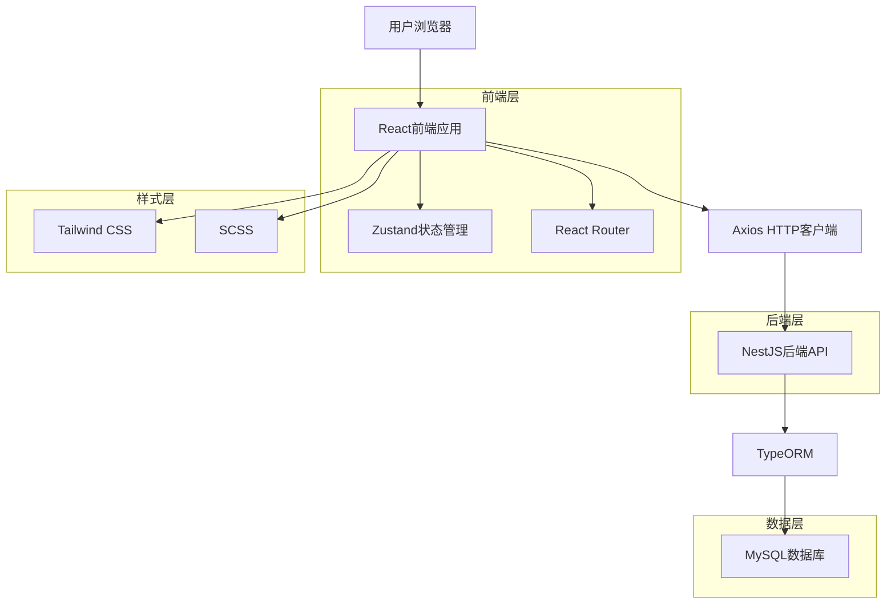
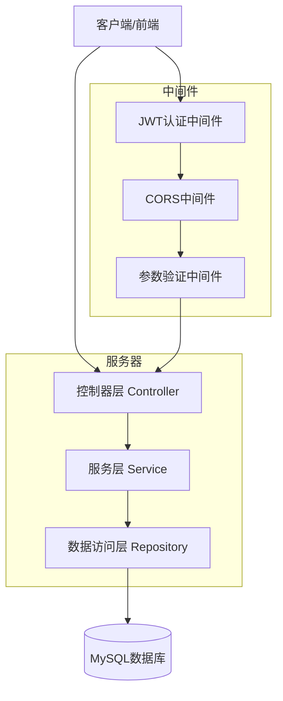
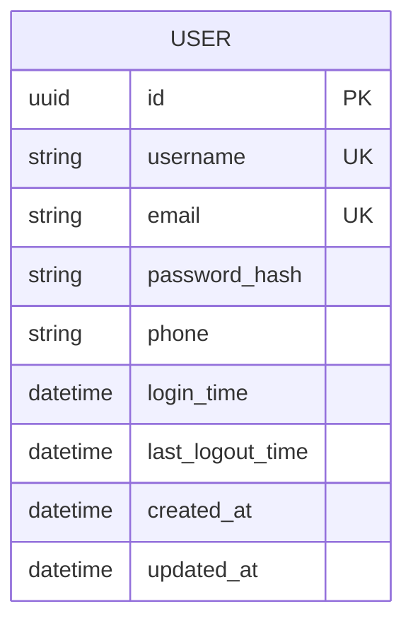

# Banyan ERP系统 - 前端重构与用户认证技术架构文档

## 1. 架构设计



## 2. 技术描述

- 前端：React@18 + TypeScript + Vite + Tailwind CSS + SCSS + Zustand + Axios + React Router
- 后端：NestJS@10 + TypeORM + MySQL + JWT + bcrypt
- 开发工具：Turbo (Monorepo管理)

## 3. 路由定义

| 路由 | 用途 |
|------|------|
| / | 主页面，登录后显示用户信息和导航 |
| /login | 登录页面，用户身份验证 |
| /register | 注册页面，新用户账户创建 |
| /dashboard | 仪表板页面，系统功能概览 |

## 4. API定义

### 4.1 核心API

#### 用户注册
```
POST /api/auth/register
```

请求参数:
| 参数名 | 参数类型 | 是否必需 | 描述 |
|--------|----------|----------|------|
| username | string | true | 用户名，3-20个字符 |
| email | string | true | 邮箱地址 |
| password | string | true | 密码，6-20个字符 |
| phone | string | false | 手机号码 |

响应参数:
| 参数名 | 参数类型 | 描述 |
|--------|----------|------|
| success | boolean | 注册是否成功 |
| message | string | 响应消息 |
| data | object | 用户基本信息 |

请求示例:
```json
{
  "username": "testuser",
  "email": "test@example.com",
  "password": "123456",
  "phone": "13800138000"
}
```

响应示例:
```json
{
  "success": true,
  "message": "注册成功",
  "data": {
    "id": "uuid",
    "username": "testuser",
    "email": "test@example.com"
  }
}
```

#### 用户登录
```
POST /api/auth/login
```

请求参数:
| 参数名 | 参数类型 | 是否必需 | 描述 |
|--------|----------|----------|------|
| username | string | true | 用户名或邮箱 |
| password | string | true | 密码 |

响应参数:
| 参数名 | 参数类型 | 描述 |
|--------|----------|------|
| success | boolean | 登录是否成功 |
| message | string | 响应消息 |
| data | object | 包含token和用户信息 |

请求示例:
```json
{
  "username": "testuser",
  "password": "123456"
}
```

响应示例:
```json
{
  "success": true,
  "message": "登录成功",
  "data": {
    "token": "eyJhbGciOiJIUzI1NiIsInR5cCI6IkpXVCJ9...",
    "user": {
      "id": "uuid",
      "username": "testuser",
      "email": "test@example.com"
    }
  }
}
```

#### 获取用户信息
```
GET /api/auth/profile
```

请求头:
| 参数名 | 参数类型 | 是否必需 | 描述 |
|--------|----------|----------|------|
| Authorization | string | true | Bearer token |

响应参数:
| 参数名 | 参数类型 | 描述 |
|--------|----------|------|
| success | boolean | 请求是否成功 |
| data | object | 用户详细信息 |

## 5. 服务器架构图



## 6. 数据模型

### 6.1 数据模型定义



### 6.2 数据定义语言

#### 用户表 (users)
```sql
-- 创建用户表
CREATE TABLE users (
    id VARCHAR(36) PRIMARY KEY DEFAULT (UUID()),
    username VARCHAR(50) UNIQUE NOT NULL,
    email VARCHAR(100) UNIQUE NOT NULL,
    password_hash VARCHAR(255) NOT NULL,
    phone VARCHAR(20),
    login_time DATETIME,
    last_logout_time DATETIME,
    created_at DATETIME DEFAULT CURRENT_TIMESTAMP,
    updated_at DATETIME DEFAULT CURRENT_TIMESTAMP ON UPDATE CURRENT_TIMESTAMP
);

-- 创建索引
CREATE INDEX idx_users_username ON users(username);
CREATE INDEX idx_users_email ON users(email);
CREATE INDEX idx_users_created_at ON users(created_at DESC);

-- 插入默认管理员账户
INSERT INTO users (username, email, password_hash, phone) VALUES 
('admin', 'admin@banyan.com', MD5('123456'), '13800138000');
```

#### JWT Token表 (可选，用于token黑名单)
```sql
-- 创建token黑名单表
CREATE TABLE token_blacklist (
    id INT AUTO_INCREMENT PRIMARY KEY,
    token_hash VARCHAR(255) NOT NULL,
    user_id VARCHAR(36) NOT NULL,
    expires_at DATETIME NOT NULL,
    created_at DATETIME DEFAULT CURRENT_TIMESTAMP,
    INDEX idx_token_hash (token_hash),
    INDEX idx_expires_at (expires_at)
);
```

## 7. 前端组件架构

### 7.1 目录结构
```
apps/web/src/
├── components/          # 通用组件
│   ├── ui/             # UI基础组件
│   ├── forms/          # 表单组件
│   └── layout/         # 布局组件
├── pages/              # 页面组件
│   ├── auth/           # 认证相关页面
│   └── dashboard/      # 仪表板页面
├── hooks/              # 自定义Hooks
├── store/              # Zustand状态管理
├── services/           # API服务
├── utils/              # 工具函数
├── styles/             # 样式文件
│   ├── globals.scss    # 全局样式
│   └── components/     # 组件样式
└── types/              # TypeScript类型定义
```

### 7.2 状态管理设计
```typescript
// 用户状态管理
interface UserState {
  user: User | null;
  token: string | null;
  isAuthenticated: boolean;
  login: (credentials: LoginCredentials) => Promise<void>;
  logout: () => void;
  register: (userData: RegisterData) => Promise<void>;
}

// 应用状态管理
interface AppState {
  loading: boolean;
  error: string | null;
  setLoading: (loading: boolean) => void;
  setError: (error: string | null) => void;
}
```

## 8. 开发步骤

### 第一阶段：环境配置
1. 清空现有前端页面内容
2. 安装并配置Tailwind CSS和SCSS
3. 安装axios、zustand、react-router-dom等依赖
4. 配置TypeScript类型定义

### 第二阶段：基础架构
1. 创建项目目录结构
2. 配置路由系统
3. 创建基础UI组件库
4. 设置状态管理store

### 第三阶段：认证功能
1. 创建登录和注册页面
2. 实现表单验证逻辑
3. 集成API服务
4. 实现JWT token管理

### 第四阶段：后端API
1. 创建用户认证控制器
2. 实现JWT认证中间件
3. 创建用户服务和数据访问层
4. 配置密码加密和验证

### 第五阶段：联调测试
1. 前后端接口联调
2. 用户流程测试
3. 错误处理测试
4. 性能优化